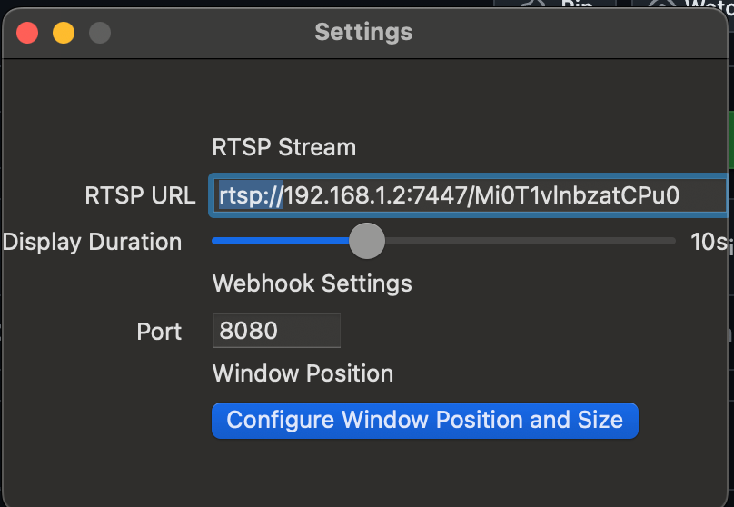
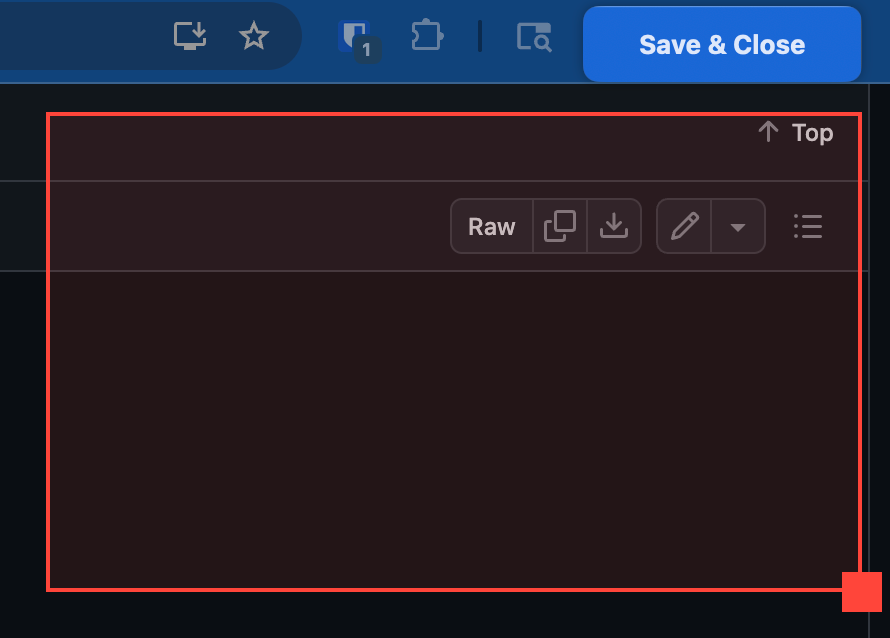
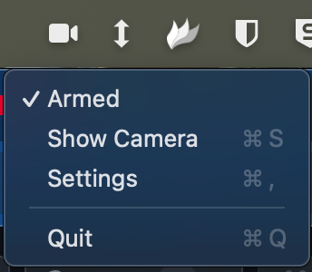

# CamPop
CamPop for macOS allows webhooks to pop open an RTSP camera stream in a window.

To run multiple instances, name each instance of the application uniquely.

# Known Issues
- Camera window is slow to pop up.
- Requires `ffplay` to be installed at `/opt/homebrew/bin/ffplay` — run `brew install ffmpeg`.
- Window size/position is currently not honored.

# Settings

- Set the RTSP URL, including `rtsp://`.
- Choose your Display Duration.
- Set your Webhook Port if needed. The default is port 8080.
- Click **Configure window size and position**, set your desired position, then click **Save & Close**.

### Usage

Launch the app or set it as a login item.

When CamPop is armed and `http://ip:8080` is hit, the configured RTSP stream will pop up on your screen.  
You can arm/disarm via the menu bar or by hitting `http://ip:8080/arm` and `http://ip:8080/disarm` respectively. This status will also be reflected in the menu bar.
